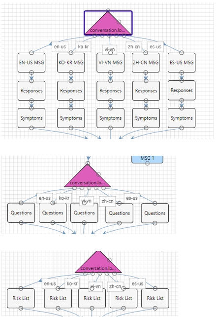
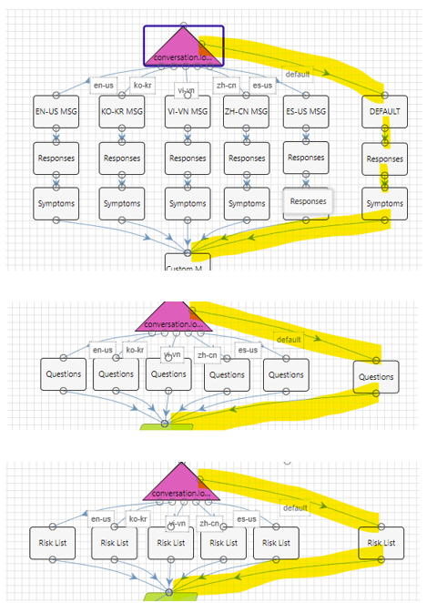
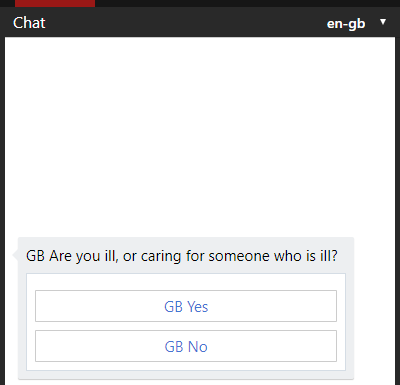

# Official Microsoft Sample

In this tutorial we will walk you through the required steps to apply a new language to the COVID-19 Triage template, using the Healthcare Bot built-in localization

## Key concepts

The COVID-19 Triage template is aligned with the scenarios published on the [CDC open source](https://github.com/CDCgov/covid19healthbot) repository. To ensure the localized strings are included within the open-source scenario, the localization is done using a switch statement within the scenario itself, rather than using the built-in Healthcare Bot localization manager. This means that customers wishing to introduce a new locale should apply their specific localized strings to the same switch.

**Note:** Customers should take into account that importing changes from the CDC open-source repository will overwrite the modifications describe in this tutorial. Customers will need to repeat the listed steps after applying any future update from the CDC-CORE protocol.

**The strings in this tutorial are aligned with the COVID-19 Triage template version as of 6th April 2020.**

## How to apply a new language within the template CORE scenario

In this tutorial, we explain how to localize the strings in the COVID-19 - CORE PROTOCOL scenario. The same method can be used to localize the COVID-19 - CDC WRAPPER scenario.
 In this sample, we will add the British English (en-GB) locale.

### Step 1: Add the default locale Action step
All the strings in the COVID-19 - CORE PROTOCOL scenario are pre-defined in a dedicated Action step. There is an individual Action step for each set of strings in each of the pre-delivered languages: American English (en-us), Korean (ko-kr), Vietnamese (vi-vn), Chinese Simplified (zh-cn) and Spanish-US (es-us).
A switch statement routes to the selected set of hard-coded strings based on the conversation locale, as you can see in the snapshots:

Edit the COVID-19 - CORE PROTOCOL scenario, add the marked Action steps, and link them to the Switch default route:

### Step 2: Edit the default locale Action steps
Now we want to initialize the scenario strings using the built-in Healthcare Bot localization, rather than hard-coded values. For that, we will use the function `session.getCustomLocalizedValue` with a new set of string IDs. 

Edit each of the Action steps and copy into it the content from the corresponding JSON file from [Actions](./Actions) folder.

### Step 3: Add the language resources to the Built-in localization manager
The last step is to create strings with the IDs of step #2. This can be done either manually, or by [importing excel](https://docs.microsoft.com/en-us/HealthBot/localization#import-logic) with the full set of IDs.

In the Healthcare Bot management portal navigate to the Localization management page (Language > Localization) and import the [core_protocol_strings](./core_protocol_strings.xlsx) excel file localized for British English (en-gb). 
To enable other languages, edit the excel file, and add a column for each required language and re-import it. Learn more about the [built-in localization manager](https://docs.microsoft.com/en-us/HealthBot/localization).

**Note:** the excel file includes 4 other languages: Amharic, Arabic, Hebrew and Russian. You should review the provided strings with language experts before using them.

## Outcome
You can now go back to the scenario and run it using the `en-gb` locale.
If you have completed the configuration and customization correctly you should see the following localized question:

## Contributing

This project welcomes contributions and suggestions.  Most contributions require you to agree to a
Contributor License Agreement (CLA) declaring that you have the right to, and actually do, grant us
the rights to use your contribution. For details, visit https://cla.opensource.microsoft.com.

When you submit a pull request, a CLA bot will automatically determine whether you need to provide
a CLA and decorate the PR appropriately (e.g., status check, comment). Simply follow the instructions
provided by the bot. You will only need to do this once across all repos using our CLA.

This project has adopted the [Microsoft Open Source Code of Conduct](https://opensource.microsoft.com/codeofconduct/).
For more information see the [Code of Conduct FAQ](https://opensource.microsoft.com/codeofconduct/faq/) or
contact [opencode@microsoft.com](mailto:opencode@microsoft.com) with any additional questions or comments.
